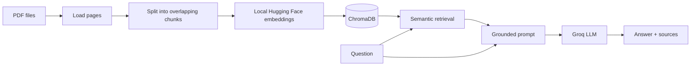
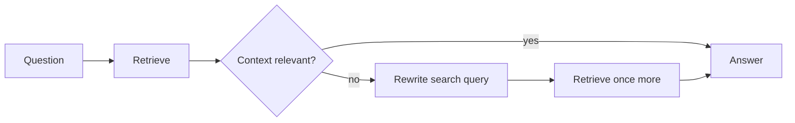

# Document RAG Pipeline

[](https://www.python.org/)
[](https://python.langchain.com/)
[](https://www.trychroma.com/)
[](https://groq.com/)

A small project for learning retrieval-augmented generation (RAG). It turns a folder of PDFs into a
searchable local knowledge base, retrieves passages related to a question, and asks a Groq-hosted
language model to answer with page-level citations.

The project stays small so each stage is easy to inspect. The command line mirrors the two phases of
a RAG system, and the agentic example adds one decision without hiding the fundamentals inside a
large framework.

**Read [MINI_LECTURE.md](MINI_LECTURE.md) first for a better understanding of RAG and the tools in
this repository. Then use this README as the practical workshop.**

## How the pipeline works



There are two separate runtime phases:

1. **Ingestion** reads every PDF page, preserves source metadata, splits text into chunks, creates
   embeddings locally with `all-MiniLM-L6-v2`, and stores them in persistent ChromaDB. Each run
   rebuilds the collection from the current files, so edited or removed PDFs cannot leave stale data.
2. **Question answering** embeds the question, retrieves the nearest chunks, and sends only those
   excerpts to Groq. The prompt requires grounded answers and numbered citations and treats PDF text
   as untrusted content rather than instructions.

The optional agentic path adds a bounded feedback loop:



This teaches query rewriting and model-directed control flow while staying predictable. The pipeline
can retry only once, so it cannot enter an expensive or infinite loop.

## Project structure

```text
.
├── MINI_LECTURE.md          # Concepts to read before the workshop
├── data/
│   └── pdf/                  # Example PDFs; add your own here
├── src/document_rag/
│   ├── document_loader.py   # PDF discovery, loading, and chunking
│   ├── vector_store.py      # Embeddings, Chroma, and stable chunk IDs
│   ├── rag.py               # Baseline retrieve-then-generate pipeline
│   ├── agentic_rag.py       # Relevance check and one query-rewrite retry
│   ├── config.py            # Environment-backed settings
│   └── cli.py               # `ingest` and `ask` commands
└── tests/                   # Fast tests with fake models; no API key needed
```

## Quick start

The project uses [uv](https://docs.astral.sh/uv/) to lock all transitive dependencies. Python 3.11,
3.12, or 3.13 is supported.

```bash
git clone https://github.com/alifarzadjamali/document-rag-pipeline.git
cd document-rag-pipeline

uv sync
cp .env.example .env
```

Add your Groq API key to `.env`, then build the local index and ask a question:

```bash
uv run document-rag ingest
uv run document-rag ask "What is the attention mechanism?"
```

Try the query-rewriting pipeline with:

```bash
uv run document-rag ask --agentic "How does the model know what words matter?"
```

To index another directory without moving its PDFs:

```bash
uv run document-rag ingest --documents /path/to/pdfs
```

The first ingestion downloads the embedding model. Later runs use the local model cache and the
persisted database in `data/vector_store/`. The database is generated output, so Git ignores it.

### Without uv

`uv` is the reproducible path, but a standard editable install also works:

```bash
python -m venv .venv
source .venv/bin/activate
python -m pip install -e .
cp .env.example .env
document-rag ingest
```

## Reading the code

Read the code in this order: `document_loader.py` → `vector_store.py` → `rag.py` →
`agentic_rag.py` → `cli.py`.

- Document code knows nothing about databases or language models.
- The vector-store module owns embeddings, persistence, and document IDs.
- RAG classes depend on LangChain's retriever and chat-model interfaces. They can be tested with
  fakes or connected to another provider.
- The CLI wires those pieces together and contains no retrieval logic.

Use the baseline by default. Agentic retrieval adds model calls and latency. Add it when evaluation
shows that unclear questions often lead to weak retrieval.

## Configuration

Defaults are suitable for the included PDFs. Override them in `.env` when experimenting:

| Variable | Default | Purpose |
| --- | --- | --- |
| `GROQ_API_KEY` | required for questions | Groq authentication |
| `GROQ_MODEL` | `openai/gpt-oss-20b` | Generation and agent decisions |
| `EMBEDDING_MODEL` | `sentence-transformers/all-MiniLM-L6-v2` | Local embedding model |
| `DOCUMENTS_DIR` | `data/pdf` | Default source directory |
| `VECTOR_STORE_DIR` | `data/vector_store` | Chroma persistence directory |
| `CHROMA_COLLECTION` | `documents` | Collection name |
| `CHUNK_SIZE` | `1000` | Maximum chunk length in characters |
| `CHUNK_OVERLAP` | `200` | Context repeated between chunks |
| `TOP_K` | `4` | Chunks retrieved per question |

Changing the embedding model creates incompatible vectors. Delete `data/vector_store/` and ingest
again after making that change.

## Design notes and trade-offs

- **Local embeddings, hosted generation:** document vectors never need a paid embedding API, while
  Groq provides fast answer generation. PDF excerpts are still sent to Groq when asking a question.
- **Character-based chunking:** it is easy to inspect and teaches the core idea. Production systems
  may benefit from token-aware, layout-aware, or semantic chunking.
- **Dense retrieval only:** Chroma cosine search is a strong baseline. Hybrid search and reranking
  should be added only after measuring retrieval failures.
- **Source citations:** retrieved metadata is displayed and the model is prompted to cite excerpt
  numbers. This improves traceability, but citations should still be verified for high-stakes use.
- **No web UI:** the CLI keeps the data flow visible and the dependency surface small. The package
  can later sit behind FastAPI, Streamlit, or another interface without changing its core modules.

## Development

Tests use LangChain's fake chat model and do not download an embedding model or call Groq:

```bash
uv run pytest
uv run ruff check .
uv run ruff format --check .
```

For a real smoke test, ingest the included PDFs and ask one question. Keep `.env` private: the file
is ignored, and `.env.example` documents only safe placeholders.

## What this project does not claim

This is a teaching-quality local RAG baseline, not a complete production service. A production
deployment still needs authentication, request limits, observability, document-level access control,
evaluation datasets, backups, and a strategy for updating or deleting individual documents.

## License

[MIT](LICENSE)
