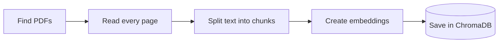
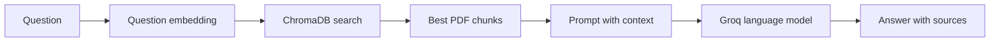
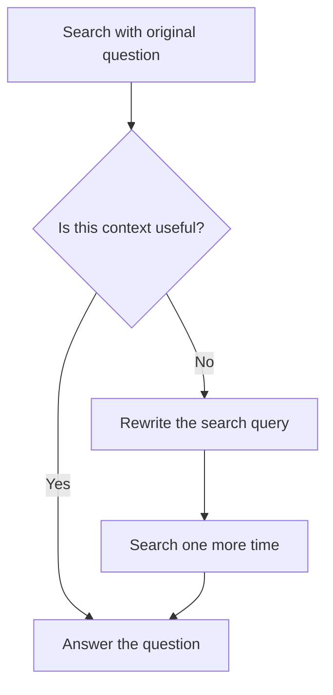

# Mini lecture: How this RAG project works

This lesson explains the project before you run the code. You do not need to know RAG, LangChain,
or vector databases yet.

When you finish this lesson, you should understand:

- why a normal language model is not enough for private documents;
- what RAG does;
- how a PDF becomes searchable;
- what ChromaDB, LangChain, and Groq do in this project;
- how the standard and agentic pipelines are different.

After the lesson, use the main [README](../README.md) as a workshop and run the project yourself.

## 1. The problem we want to solve

Imagine that you have a PDF about attention in neural networks. You want to ask:

> What is the attention mechanism?

A language model may know something about attention from its training. However, it has three
problems:

1. It may not know what is inside your PDF.
2. It may give a general answer instead of using your document.
3. It may invent information. This is often called a hallucination.

We want the model to read the useful parts of our PDF before it answers. RAG helps us do this.

## 2. What is RAG?

RAG means **Retrieval-Augmented Generation**.

The name describes two jobs:

- **Retrieval:** find useful text in our documents.
- **Generation:** give that text to a language model and ask it to write an answer.

You can think of RAG as an open-book exam. The language model is the student. Before the student
answers, we find the best pages in the book and place them on the desk.

RAG does not train a new language model. It adds useful information to the prompt at question time.

```text
question → find useful PDF text → give text to the model → grounded answer
```

## 3. RAG has two phases

### Phase A: prepare the documents

We do this when we run:

```bash
uv run document-rag ingest
```

The program follows these steps:



First, LangChain's PDF loader reads the files one page at a time. We keep the PDF name and page
number because we will need them for citations.

Next, we split long pages into smaller pieces called **chunks**. Searching small, focused chunks is
usually more useful than searching a whole book at once. A little text overlaps between neighboring
chunks so an important sentence is less likely to be cut in half.

Then we turn every chunk into an **embedding**. An embedding is a list of numbers that represents
the meaning of text. Texts with similar meanings have embeddings that are close together.

Finally, we save the text, embeddings, and source information in ChromaDB.

### Phase B: answer a question

We do this when we run:

```bash
uv run document-rag ask "What is the attention mechanism?"
```

The program follows these steps:



The question is converted into an embedding with the same embedding model used during ingestion.
ChromaDB compares it with the stored vectors and returns the closest chunks.

We place those chunks in a prompt. The prompt tells the language model to use only the supplied
text, say when information is missing, and cite its sources. Groq runs the language model and sends
the answer back to us.

## 4. What each tool does

### LangChain: the common interface

LangChain is a Python library for building applications that use language models and documents.

In this project, it gives us common building blocks for:

- loading PDF pages;
- splitting text;
- creating embeddings;
- talking to ChromaDB;
- talking to Groq;
- representing prompts, messages, and documents.

Why use it? Each provider has a different API. LangChain gives them a similar shape. This keeps the
main pipeline readable and makes parts easier to replace or test.

LangChain does not store our vectors and it is not the language model. It connects the pieces.

### ChromaDB: the searchable memory

ChromaDB is a vector database. A vector database stores embeddings and searches for nearby vectors.

For each chunk, we store:

- its embedding;
- its original text;
- its PDF filename;
- its page number;
- its position on the page.

When a question arrives, ChromaDB finds chunks with a similar meaning. This is semantic search. The
words do not have to match exactly. For example, a search about “words that matter” may find a
paragraph about “attention weights.”

ChromaDB runs locally here. Its generated files are saved in `data/vector_store/` and are not added
to Git. Ingestion rebuilds the collection so old or deleted PDFs do not leave stale results.

### The embedding model: the meaning converter

We use `sentence-transformers/all-MiniLM-L6-v2` from Hugging Face. It runs on the local computer.
Its job is only to convert text into vectors. It does not write the final answer.

We must use the same embedding model for documents and questions. Otherwise, their vectors would
not belong to the same meaning space.

### Groq: fast hosted model inference

Groq is the online service that runs our language model. It is the inference provider, not the
vector database and not the RAG pipeline.

This project uses Groq's `openai/gpt-oss-20b` model. LangChain sends the question and retrieved PDF
chunks to Groq. Groq runs the model and returns generated text.

The embedding step is local, but question answering is not fully private: the retrieved chunks are
sent to Groq. A valid `GROQ_API_KEY` and an internet connection are required when asking questions.

## 5. What the standard RAG pipeline does

The standard pipeline is in `src/document_rag/rag.py`.

It has a short, fixed workflow:

1. Search ChromaDB with the user's question.
2. Take the best document chunks.
3. Add the chunks and question to a careful prompt.
4. Ask the Groq model for an answer.
5. Show the answer and source pages.

This is the best place to begin learning. The steps are easy to follow, the cost is predictable,
and one question needs only one language-model call.

## 6. What makes the other pipeline agentic?

The agentic pipeline is in `src/document_rag/agentic_rag.py`.

An agent can inspect a result and choose what action to take next. Our agent has only one small,
safe decision:



For example, a student may ask:

> How does it know which words matter?

That wording may be too vague for search. The model can rewrite it as something like:

> Transformer attention weights for relevant input tokens

The program searches once more with the clearer query. It still answers the student's original
question.

The loop is limited to one retry. This matters because unlimited agents can become slow, expensive,
or difficult to understand. Agentic RAG also uses more model calls than standard RAG, so it should
solve a real retrieval problem—not be added only because it sounds advanced.

## 7. What RAG improves—and what it does not

RAG gives the model relevant, current, or private information without retraining it. It also makes
answers easier to inspect because we show source pages.

RAG does not guarantee a correct answer. Problems are still possible:

- the PDF may contain bad information;
- the chunks may be too large or too small;
- retrieval may select the wrong chunks;
- the model may misunderstand good context;
- a citation may not fully support a claim.

That is why serious RAG systems need evaluation. We should test real questions, check whether the
right chunks were retrieved, and verify whether the final answers are supported by those chunks.

## 8. Follow the code in this order

Read the small modules in this order:

1. `document_loader.py` — find PDFs, read pages, and create chunks.
2. `vector_store.py` — create embeddings and save chunks in ChromaDB.
3. `rag.py` — retrieve context and generate a grounded answer.
4. `agentic_rag.py` — judge retrieval and optionally rewrite the query.
5. `config.py` — keep settings in one place.
6. `cli.py` — connect everything to the `ingest` and `ask` commands.

Notice that each file has one main responsibility. This is useful beyond RAG: small boundaries make
software easier to read, test, and change.

## 9. Your workshop

You now know the idea. Continue with the [README quick start](../README.md#quick-start) to:

1. install the exact dependencies;
2. add a Groq API key;
3. ingest the included PDFs;
4. ask a standard RAG question;
5. try the agentic pipeline;
6. read the tests and change one setting at a time.

As you experiment, ask yourself two separate questions:

1. **Retrieval quality:** did ChromaDB find the right text?
2. **Answer quality:** did the language model use that text correctly?

Keeping those questions separate is one of the most important lessons in building good RAG systems.
